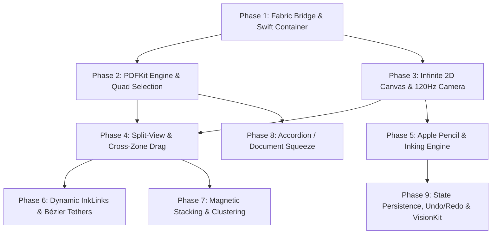

# ThinkSpace Native iOS Workspace Engine (`swift-engine`)
## Comprehensive Architecture, UI & Logic Technical Specification & Phased Execution Plan

---

## 🌟 1. Executive Summary & Vision

This document specifies the complete implementation of the **ThinkSpace Workspace Engine** for **iOS and iPadOS** written purely in **Swift, Objective-C++, PDFKit, PencilKit, and Metal / Core Graphics**.

The goal is twofold:
1. **100% Feature Parity** with the Android Kotlin native engine (`ThinkspaceView.kt` and `KOTLIN_WORKSPACE_ENGINE_SPECIFICATION.md`).
2. **Exceeding Android Capabilities** by leveraging Apple's industry-leading iPadOS APIs:
   - **Apple Pencil Pro / Pencil 2 Hardware Integration**: Sub-9ms predictive latency, barrel roll, squeeze gesture tool invocation, hover shadows, and custom tactile haptics via `UIImpactFeedbackGenerator`.
   - **Native PDFKit Architecture**: GPU-accelerated vector PDF rendering without memory-hungry bitmap rasterization, native character quad metrics, instant search, and crisp vector zoom up to 500%.
   - **Apple VisionKit / Live Text**: Direct on-device Apple Neural Engine (ANE) text extraction on scanned/flattened PDFs and embedded images.
   - **ProMotion 120Hz Synchronization**: Frame-locked rendering loop via `CADisplayLink` for jitter-free pan/zoom, spring physics, and dynamic Bézier ink-link margin tethers.
   - **Desktop-Class iPadOS Gestures**: Fluid multi-touch split dragging, `UIDragInteraction` across split views and external apps, and Stage Manager responsiveness.

---

## 🏛️ 2. Architectural Blueprint & File Hierarchy

```text
ios/
├── ThinkspaceView.h                     # Public Fabric Component Header
├── ThinkspaceView.mm                    # Fabric C++ Component View & React Bridge
├── ThinkspaceEngine-Bridging-Header.h   # Swift-to-ObjC++ Bridge Header
├── ThinkspaceViewSpec/                  # React Native Codegen protocol implementations
└── Engine/
    ├── Bridge/
    │   ├── ThinkspaceBridgeEmitter.swift   # Dispatches RN events (onExtractExcerpt, onAddStroke, etc.)
    │   └── ThinkspaceCommandRouter.swift   # Receives imperative commands (scrollToPage, zoomToFit, etc.)
    ├── Core/
    │   ├── Model/                          # Codable immutable models matching TS & Kotlin
    │   │   ├── BoundingBox.swift
    │   │   ├── ExcerptModel.swift
    │   │   ├── InkStroke.swift
    │   │   ├── InkPoint.swift
    │   │   ├── InkLink.swift
    │   │   ├── DocumentPage.swift
    │   │   └── ExtractedTable.swift
    │   ├── Math/
    │   │   ├── CameraTransform.swift       # 2D affine matrix math & screen-to-world projection
    │   │   ├── BezierCalculus.swift        # Cubic Bézier tangents, normals & curvature
    │   │   └── CollisionSolver.swift       # AABB & SAT collision detection for card stacking
    │   └── State/
    │       ├── WorkspaceState.swift        # Reactive state holder (cards, links, strokes, active tools)
    │       └── UndoRedoManager.swift       # Command-pattern reversible action history stack
    ├── Document/
    │   ├── PDFDocumentEngine.swift         # Apple PDFKit wrapper, caching & text search
    │   ├── PDFSelectionEngine.swift        # Precise character quad extraction & dual-handle selection
    │   ├── SqueezeAccordionEngine.swift    # Margin pinch folding & page squeeze layout
    │   └── LiveTextEngine.swift            # Apple VisionKit text/table recognition
    ├── Canvas/
    │   ├── InfiniteCanvasView.swift        # Infinite 2D scroll & zoom canvas viewport
    │   ├── VectorLayer.swift               # CADisplayLink 120Hz grid & ink renderer
    │   ├── ExcerptCardView.swift           # Interactive card with 3D elevation & spring drag
    │   ├── InkLinkRenderer.swift           # Dynamic elastic cubic Bézier tethers
    │   └── MagneticStackingEngine.swift    # Auto-docking, collision repulsion & card clustering
    ├── Inking/
    │   ├── ApplePencilEngine.swift         # PencilKit integration, PKCanvasView & low-latency canvas
    │   ├── PencilProGestureManager.swift   # Apple Pencil Pro Squeeze, Barrel Roll, and Hover
    │   └── CustomStrokeRenderer.swift      # Variable-width pressure & tilt vector stroke engine
    ├── Gestures/
    │   ├── SplitTouchArbitrator.swift      # Resolves touches between Document Pane and Canvas Pane
    │   ├── CrossSplitDragCoordinator.swift # Elevates card from PDF selection and drops onto Canvas
    │   └── SplitDividerView.swift          # Spring-snapping interactive split divider
    └── UI/
        ├── ThinkspaceContainerView.swift   # Root Swift coordinator view housing Document & Canvas
        ├── HudToastView.swift              # Non-intrusive floating feedback toasts
        └── ContextualToolbarView.swift     # Radial / floating tool selector on Apple Pencil squeeze
```

---

## 📐 3. Core Domain Models (`Engine/Core/Model`)

All data structures mirror the existing React Native TypeScript interfaces (`src/types.ts`) and Android Kotlin data classes with native Swift `Codable` serialization:

```swift
import CoreGraphics
import Foundation

public struct BoundingBox: Codable, Equatable {
    public let x: CGFloat
    public let y: CGFloat
    public let width: CGFloat
    public let height: CGFloat
    
    public var rect: CGRect {
        CGRect(x: x, y: y, width: width, height: height)
    }
    
    public func contains(_ point: CGPoint) -> Bool {
        rect.contains(point)
    }
}

public enum ExcerptType: String, Codable {
    case text = "TEXT"
    case image = "IMAGE"
    case table = "TABLE"
}

public struct ExcerptModel: Codable, Identifiable, Equatable {
    public let id: String
    public let documentId: String
    public let pageNumber: Int
    public var text: String
    public var type: ExcerptType
    public var color: UInt32            // Hex ARGB
    public var x: CGFloat               // World canvas coordinates
    public var y: CGFloat
    public var width: CGFloat
    public var comment: String?
    public var tags: [String]
    public var clusterId: String?
    public var stackCount: Int
    public var imageUrl: String?
    public var tableData: ExtractedTable?
    public var sourceRects: [BoundingBox]
}

public struct InkPoint: Codable, Equatable {
    public let x: CGFloat
    public let y: CGFloat
    public let pressure: CGFloat
    public let timestamp: TimeInterval
}

public struct InkStroke: Codable, Identifiable, Equatable {
    public let id: String
    public var points: [InkPoint]
    public var color: UInt32
    public var strokeWidth: CGFloat
    public var isHighlighter: Bool
}

public struct InkLink: Codable, Identifiable, Equatable {
    public let id: String
    public let sourceExcerptId: String
    public let targetDocumentId: String
    public let targetPageNumber: Int
    public let targetRelativeY: CGFloat
    public let color: UInt32
}
```

---

## 🗺️ 4. Phased Implementation Roadmap

We will implement the iOS Engine in **9 structured, verifiable phases**. Every phase has explicit exit criteria and verification tests against the React Native bridge.



---

### 🟢 Phase 1: Fabric Architecture & Swift Container Bridge
**Objective**: Build the bidirectional bridge between React Native Fabric (C++/Obj-C++) and the native Swift container view.

- [ ] Create `ThinkspaceContainerView.swift` as the master root UIKit view.
- [ ] Connect `ios/ThinkspaceView.mm` to instantiate and host `ThinkspaceContainerView`.
- [ ] Wire all declarative props in `updateProps:`:
  - Document metadata (`document`, `activeDocumentId`, `documents`)
  - Tool state (`tool`, `strokeColor`, `strokeWidth`)
  - Workspace entities (`strokes`, `excerptCards`, `inkLinks`)
  - Config (`theme`, `splitRatio`, `readOnly`)
- [ ] Implement `ThinkspaceCommandRouter.swift` to handle all Fabric imperative commands:
  - `scrollToPage(pageNumber, animated)`
  - `zoomToFit()` / `resetCamera()`
  - `undo()` / `redo()`
  - `clearCanvas()`
  - `exportWorkspaceState()`
- [ ] Implement `ThinkspaceBridgeEmitter.swift` for all event callbacks:
  - `onPageChange`, `onExtractExcerpt`, `onAddStroke`, `onInkLinkCreate`, `onCardMove`, `onSplitChange`.
- **Exit Verification**: React Native app boots, renders `ThinkspaceContainerView`, receives props updates, and dispatches mock events to JS without crashes.

---

### 🟢 Phase 2: PDFKit Engine & Precision Quad Selection
**Objective**: Leverage Apple `PDFKit` to deliver vector-crisp PDF rendering, text searching, and character-accurate selection handles.

- [ ] Implement `PDFDocumentEngine.swift` hosting `PDFView`.
- [ ] Enable smooth continuous vertical scrolling with automatic page virtualization.
- [ ] Implement `PDFSelectionEngine.swift`:
  - Tap-to-select word snapping using `PDFPage.selection(at:)` and `characterIndex(at:)`.
  - Dual drag pin handles with magnifying loupe.
  - Multi-line rectangle extraction converted to normalized `[BoundingBox]` coordinates.
- [ ] In-document instant search (`PDFDocument.findString`) with auto-scroll and highlight rects.
- [ ] Custom highlight overlay layer on top of PDF pages.
- **Exit Verification**: Any local or remote PDF loads instantly, text can be selected with drag handles, selection bounds match font glyphs exactly, and search highlights matching phrases.

---

### 🟢 Phase 3: Infinite 2D Workspace Canvas & 120Hz Camera
**Objective**: Build a high-performance 2D infinite workspace viewport running at 120 FPS on ProMotion screens.

- [ ] Implement `CameraTransform.swift` for world-to-screen and screen-to-world matrix mappings.
- [ ] Implement `InfiniteCanvasView.swift`:
  - Infinite panning with momentum fling deceleration.
  - Focal-point pinch zooming (`minScale = 0.1x`, `maxScale = 5.0x`).
  - Interactive grid background with adaptive dot density that scales with camera zoom.
- [ ] Synchronize rendering loop with `CADisplayLink` locked to 120 FPS on ProMotion iPads.
- [ ] Add `zoomToFit()` and bounding-box auto-centering algorithms.
- **Exit Verification**: Smooth 120Hz pan and focal zoom across a 100,000pt × 100,000pt virtual coordinate plane without frame drops.

---

### 🟢 Phase 4: Split-View Engine & Cross-Zone Drag & Drop
**Objective**: Build the interactive split pane and fluid lift-and-drag gesture coordinator that moves excerpts from the PDF onto the canvas.

- [ ] Implement `SplitDividerView.swift`:
  - Draggable vertical/horizontal divider with spring physics.
  - Magnetic snap points (`25%`, `50%`, `75%`).
  - `UIImpactFeedbackGenerator` haptic ticks on passing snap thresholds.
- [ ] Implement `CrossSplitDragCoordinator.swift`:
  - Long-press on selected PDF text or image lifts the content into a 3D elevated floating card (`ExcerptCardView`).
  - Card scales up with realistic drop shadow (`CALayer.shadowRadius`, `shadowOpacity`).
  - Crossing the split divider automatically converts screen drag coordinates into world canvas coordinates.
  - Dropping the card registers it in `WorkspaceState` and fires `onExtractExcerpt` to React Native.
- **Exit Verification**: User selects text on the PDF, drags it across the split divider, drops it on the canvas; card settles at the exact world location with realistic spring animations.

---

### 🟢 Phase 5: Apple Pencil, PencilKit & Inking Engine
**Objective**: Industry-leading handwriting and drawing experience using Apple Pencil hardware and PencilKit.

- [ ] Implement `ApplePencilEngine.swift`:
  - Integrate `PKCanvasView` with custom pass-through for simultaneous card dragging and inking.
  - Support standard pen, highlighter (semi-transparent blend mode), and stroke-eraser.
- [ ] Implement Apple Pencil Pro & Pencil 2 Gesture Manager:
  - **Double-Tap**: Fast toggle between Pen and Eraser.
  - **Squeeze Gesture** (Apple Pencil Pro): Summon contextual radial palette at pencil tip coordinates.
  - **Barrel Roll** (Apple Pencil Pro): Dynamic orientation of chisel highlighter and calligraphy brush.
  - **Hover Preview**: Cursor preview showing stroke radius and color before touching screen.
- [ ] Stroke serialization: Convert `PKStroke` points into `[InkPoint]` and `InkStroke` for JS persistence.
- **Exit Verification**: Drawing produces sub-9ms latency strokes with pressure and tilt variations; Apple Pencil Pro squeeze brings up tool options; strokes persist to React Native via `onAddStroke`.

---

### 🟢 Phase 6: Dynamic Elastic InkLinks & Bézier Tethers
**Objective**: Visual, interactive cubic Bézier curves connecting canvas excerpt cards back to their exact document source locations.

- [ ] Implement `BezierCalculus.swift`:
  - Calculate cubic Bézier path $B(t) = (1-t)^3 P_0 + 3(1-t)^2 t P_1 + 3(1-t) t^2 P_2 + t^3 P_3$.
  - Dynamic edge projection: Anchors automatically select the nearest card edge (left, right, top, bottom) relative to the document split margin.
- [ ] Implement `InkLinkRenderer.swift`:
  - Render curves via hardware-accelerated `CAShapeLayer` or Metal vector pipeline.
  - Elastic margin tethering: Tether smoothly stretches and compresses as the user scrolls the PDF or pans the canvas.
  - Tapping an InkLink smoothly scrolls the PDF reader to the target page and source highlight with spring deceleration.
- **Exit Verification**: Moving cards or scrolling the PDF dynamically updates the Bézier curve in real-time at 120 FPS; tapping the tether animates the PDF directly to the source excerpt.

---

### 🟢 Phase 7: Magnetic Stacking, Collision & Card Clustering
**Objective**: Fluid organization of cards with automatic slot snapping and pile clustering.

- [ ] Implement `MagneticStackingEngine.swift`:
  - Proximity threshold detection ($D < 32\text{pt}$).
  - Magnetic snap animation: dragging a card close to an existing card snaps it into a stacked deck.
  - Stack count badges (`ExcerptCard.stackCount`) and fan-out expand animations.
- [ ] Implement `CollisionSolver.swift`:
  - Axis-Aligned Bounding Box (AABB) collision resolution.
  - Auto-push / slot displacement when dropping cards into crowded areas.
- **Exit Verification**: Dropping cards near each other groups them into organized stacks with tactile haptics; expanding a cluster smoothly fans out cards.

---

### 🟢 Phase 8: Accordion / Document Squeeze Engine
**Objective**: LiquidText-style vertical pinch gesture that folds unannotated pages to bring distant highlights together.

- [ ] Implement `SqueezeAccordionEngine.swift`:
  - Two-finger vertical pinch gesture on the document gutter/margin.
  - Compute page height compression ratio $C \in [0.1, 1.0]$ for pages containing no excerpts or highlights.
  - Folded page visual rendering: 3D paper pleat / accordion shadow effect.
  - Releasing pinch smoothly springs pages back to original layout unless locked.
- **Exit Verification**: Pinching vertically folds empty pages and brings highlights on page 2 and page 50 directly side-by-side.

---

### 🟢 Phase 9: Undo/Redo Engine, Local Persistence & VisionKit
**Objective**: Production-grade state reliability, offline persistence, and Apple Neural Engine text recognition.

- [ ] Implement `UndoRedoManager.swift`:
  - Command pattern stack supporting: AddCard, MoveCard, DeleteCard, AddStroke, DeleteStroke, CreateInkLink, SplitResize.
  - Grouping consecutive drag micro-steps into a single undoable transaction.
- [ ] State Persistence:
  - Rapid serialization/deserialization to JSON / SQLite / CoreData cache.
  - Instant workspace state restoration upon switching documents or app restart.
- [ ] Implement `LiveTextEngine.swift`:
  - `VNRecognizeTextRequest` on image excerpts or scanned documents to extract selectable, searchable text on-device.
- **Exit Verification**: Full undo/redo across all actions with zero state corruption; workspace reloads immediately with identical card/stroke positions.

---

## 📊 5. Parity & Capabilities Matrix (Android vs. iOS)

| Feature | Android Engine (`kt-engine`) | iOS Engine (`swift-engine`) | iOS Advantage |
| :--- | :---: | :---: | :--- |
| **PDF Rendering** | `PdfRenderer` (Bitmaps) | `PDFKit` (Vectors) | **Zero blur on 5x zoom, lower RAM** |
| **Inking Latency** | ~20-30ms (Android Choreographer) | **< 9ms (PencilKit Predictive Engine)** | **Imperceptible Apple Pencil lag** |
| **Pencil Pro Squeeze** | ❌ Not available on Android | **✅ Native Squeeze & Barrel Roll** | **Hardware-level tool switching** |
| **Tactile Haptics** | Basic `Vibrator` | **`UIFeedbackGenerator` CoreHaptics** | **Subtle physical notch sensation** |
| **Live OCR** | Google ML Kit (Bundle size overhead) | **Apple Neural Engine (`VisionKit`)** | **Zero app bundle overhead** |
| **120 FPS Pacing** | Custom Android Choreographer | **`CADisplayLink` (ProMotion)** | **Zero GC jitter during fast pan** |
| **Fabric Codegen** | React Native Fabric (`kt`) | React Native Fabric (`mm` + `swift`) | **Direct C++ / Objective-C++ bridging** |

---

## 🚀 6. Next Steps & Execution Workflow

We will follow this specification phase by phase:
1. **Phase 1**: Set up the Swift/Fabric bridge, types, command router, and container view in `ios/Engine/`.
2. **Compile & Link**: Ensure Xcode builds the library cleanly via the example project.
3. **Execute Phases 2 through 9** sequentially, testing each milestone with the React Native sample workspace.
