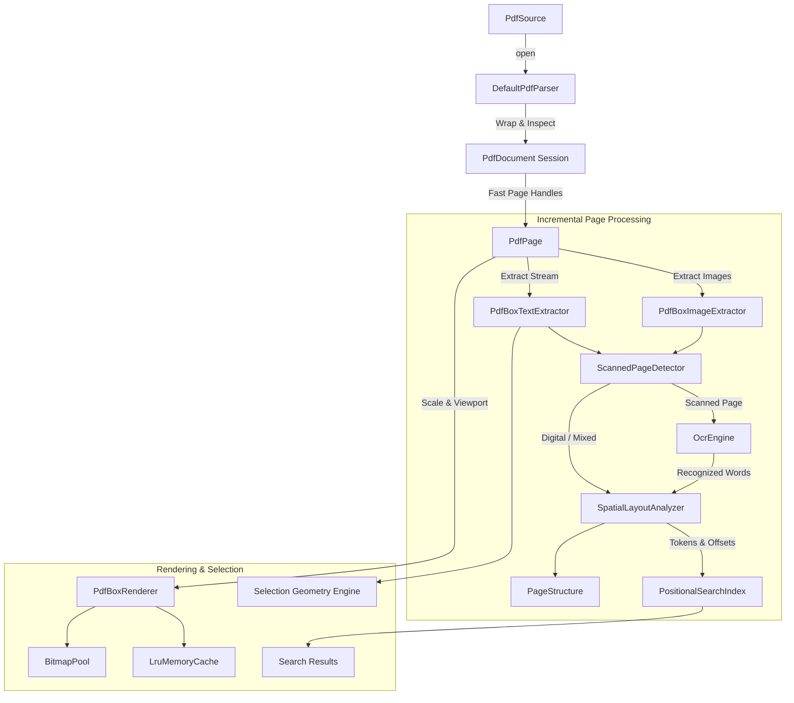

# Architecture & Technical Design

## 1. Modular Overview

The `pdf-engine` module is structured around high cohesion, strict separation of concerns, and clean interface boundaries:

```
pdf-engine/
├── api/          # Public engine contracts (PdfDocumentEngine, PdfDocument, PdfPage, Options)
├── core/         # Engine orchestrator implementation (DefaultPdfDocumentEngine)
├── model/        # Strongly-typed, immutable domain data structures (Geometry, TextElements, Layout)
├── coordinates/  # Pure math coordinate transformation matrix (PdfCoordinateMapper)
├── parser/       # PDF loading, descriptor parsing, decryption, and version inspection
├── extraction/   # Spatial text and embedded image extractors (PDFBox wrappers)
├── layout/       # Geometric reading order, line/block/paragraph/column/heading analyzers
├── ocr/          # Scanned page classifier and on-device OCR engine (ML Kit)
├── rendering/    # Viewport rasterizer, bitmap recycler, and scale manager
├── indexing/     # In-memory positional inverted index for fast substring search
├── cache/        # Bounded LRU cache for bitmaps, text words, and page structures
├── storage/      # File staging and deterministic resource cleanup tracker
├── annotations/  # PDF annotation extraction and spatial associations
├── errors/       # Sealed domain error hierarchy (PdfEngineError)
├── logging/      # Structured diagnostic logger
└── internal/     # Concurrency utilities
```

---

## 2. Processing Pipeline

The engine separates fast initial document opening from expensive incremental processing:



### Pipeline Guarantees:
1. **Zero Eager Full-Document Loading**: Opening a 500-page PDF only reads the Document Catalog and Trailer (sub-100ms).
2. **Page-Independent Execution**: Page 1 can be extracted, analyzed, and rendered immediately while background jobs process subsequent pages.
3. **Structured Concurrency**: All long-running operations run on background Kotlin dispatchers (`Dispatchers.IO` for file reads, `Dispatchers.Default` for math/geometry/clustering) with continuous cancellation checks (`ensureActive()`).

---

## 3. Coordinate Systems & Math

PDF User Space differs fundamentally from screen rendering and Android UI spaces:

| Coordinate System | Origin | X Direction | Y Direction | Units |
|---|---|---|---|---|
| **PDF User Space** | Bottom-Left | Right (+) | UP (+) | Points (1/72") |
| **Page Coordinate Space** | Top-Left (Rotated) | Right (+) | DOWN (+) | Points (1/72") |
| **Render Coordinate Space** | Top-Left | Right (+) | DOWN (+) | Device Pixels |
| **Viewport Coordinate Space**| Top-Left of Viewport | Right (+) | DOWN (+) | Screen Pixels |

### Transformation Math:
Given CropBox $[X_0, Y_0, X_1, Y_1]$:
- For $0^\circ$: $x_{\text{page}} = x_{\text{pdf}} - X_0$, $y_{\text{page}} = Y_1 - y_{\text{pdf}}$
- For $90^\circ$: $x_{\text{page}} = y_{\text{pdf}} - Y_0$, $y_{\text{page}} = x_{\text{pdf}} - X_0$
- For $180^\circ$: $x_{\text{page}} = X_1 - x_{\text{pdf}}$, $y_{\text{page}} = y_{\text{pdf}} - Y_0$
- For $270^\circ$: $x_{\text{page}} = Y_1 - y_{\text{pdf}}$, $y_{\text{page}} = X_1 - x_{\text{pdf}}$

The `PdfCoordinateMapper` encapsulates these equations bidirectionally with unit test verification across all rotations and arbitrary crop offsets.

---

## 4. Memory & Resource Safety

To prevent native memory leaks and out-of-memory crashes:
1. **`ResourceManager`**: Every opened `PdfDocument` registers all underlying `PDDocument`, `InputStream`, `FileDescriptor`, and temporary staging files. Closing the document safely closes and disposes all handles deterministically.
2. **`BitmapPool`**: Reuses hardware-backed `Bitmap` allocations of matching configurations to eliminate GC pauses during fast scroll and pinch-zoom operations.
3. **`LruMemoryCache`**: Bounds memory to a fixed ceiling (default 64MB) and evicts oldest rendered pages and layout trees on demand.
4. **OOM Safeguards**: Large zoom operations compute memory requirements before allocation and throw `PdfEngineError.OutOfMemoryRisk` if requested allocation exceeds thresholds.
